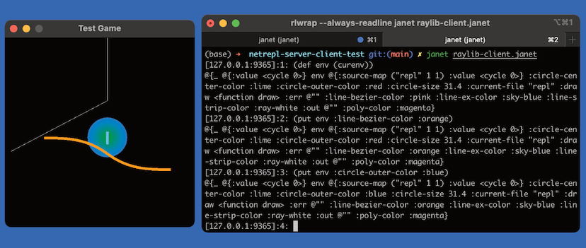
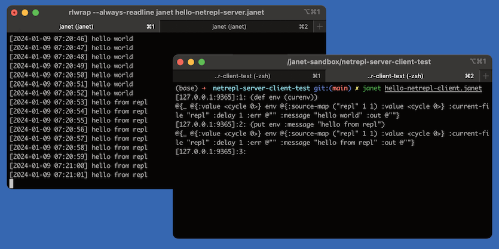

# Janet interactive repl (netrepl) communication demos

demos of interactive repl communication using netrepl

## Screenshots

- raylib (jaylib)



- hello-netrepl



## Prerequisites

- install [janet](https://janet-lang.org/)
- install spork and jaylib

```bash
$ jpm install spork
$ jpm install jaylib
```

## hello-netrepl

The server prints "hello" every seconds, client repl can change the message and delay interval. (after 5 sec, value change worker will automatically change the message to "hello world")

- first, start the server

```bash
$ janet hello-netrepl-server.janet
```

- in another terminal, start the client

```bash
$ janet hello-netrepl-client.janet

# [repl] $ (def env (curenv))
# [repl] $ (put env :message "hello from repl")
# [repl] $ (put env :delay 2)
```

## raylib (jaylib)

Raylib interactive demo, client repl can change the colors and draw function itself

- first, start the server

```bash
$ janet raylib-server.janet
```

- in another terminal, start the client

```bash
$ janet raylib-client.janet

# [repl] $ (def env (curenv))
# [repl] $ (get env :circle-outer-color)
# [repl] $ (put env :circle-outer-color :blue)
# [repl] $ (get env :line-bezier-color)
# [repl] $ (put env :line-bezier-color :orange)
# [repl] $ (def draw2 '(fn [] (clear-background [0 0 0]) ))
# [repl] $ (put env :draw_fn_sexp draw2)
# [repl] $ (def draw3 '(fn [] (clear-background [0 0 0]) (let [[x y] (get-mouse-position)] (draw-rectangle (- (math/floor x) 30) (- (math/floor y) 30) 60 60 :red)) ))
# [repl] $ (put env :draw_fn_sexp draw3)
```